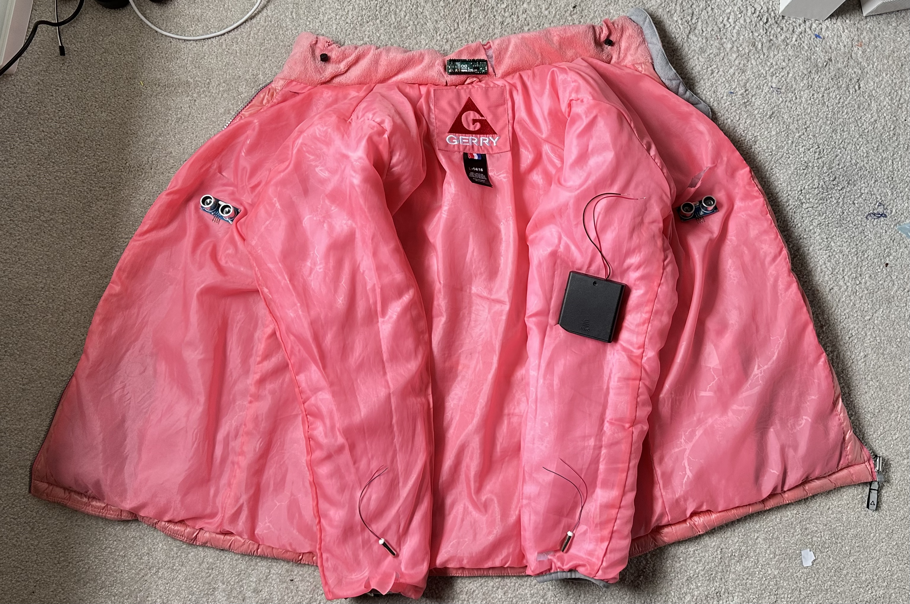
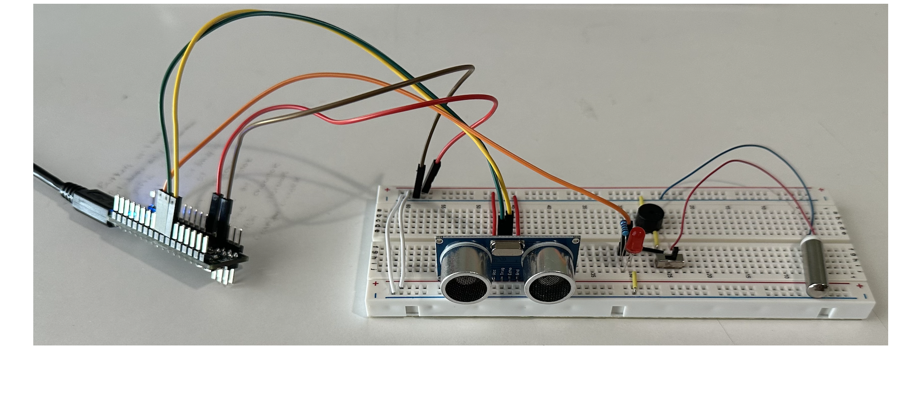
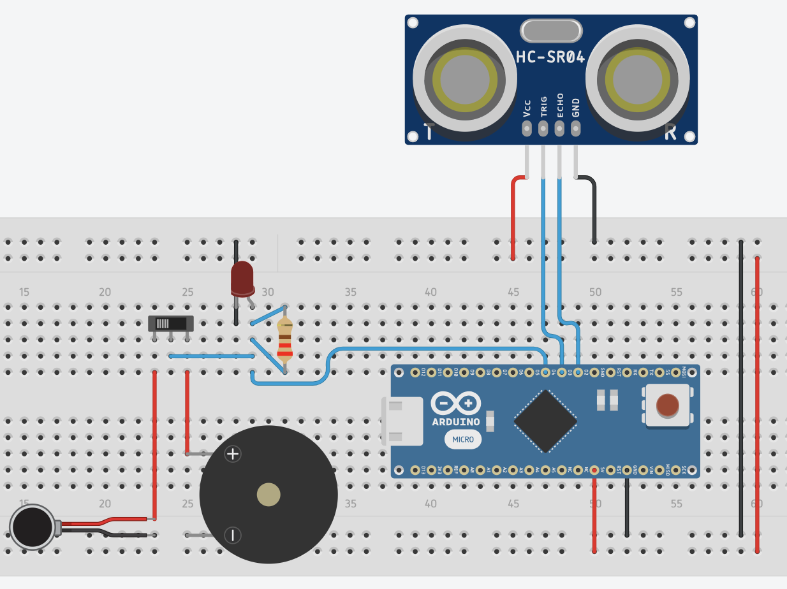
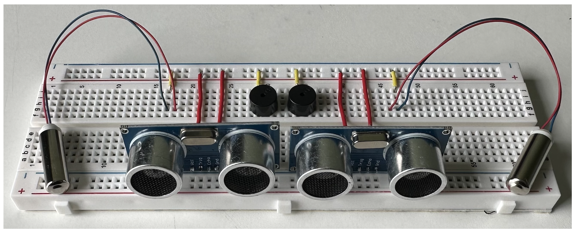
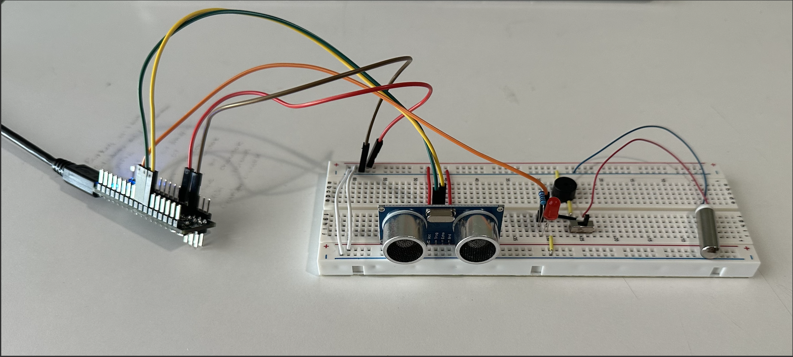
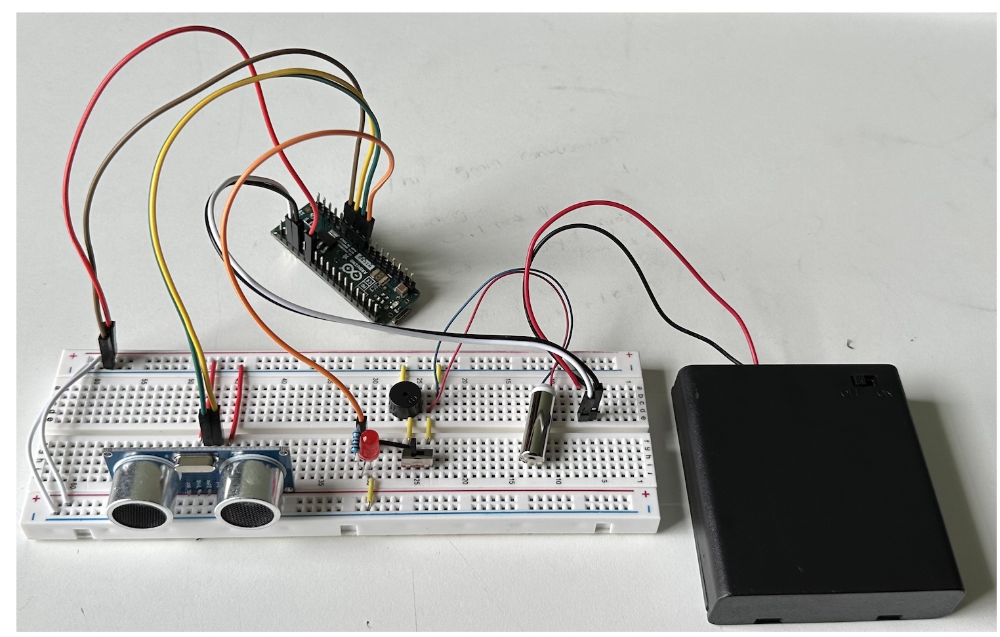
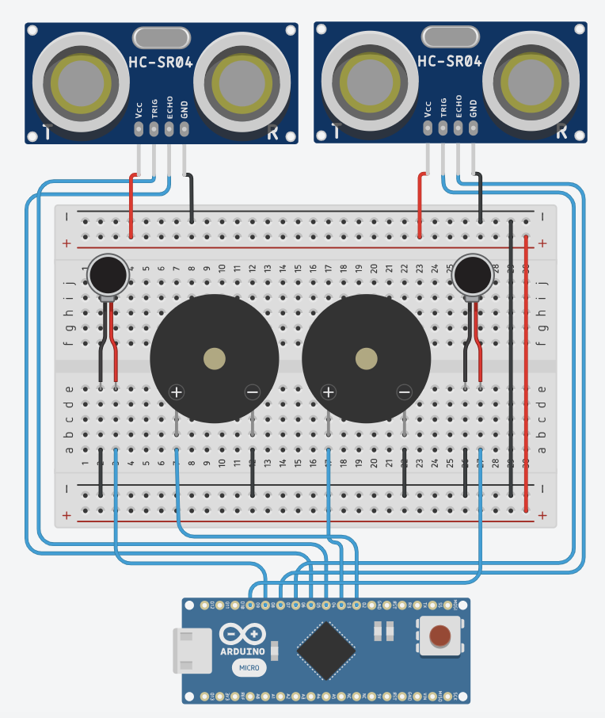
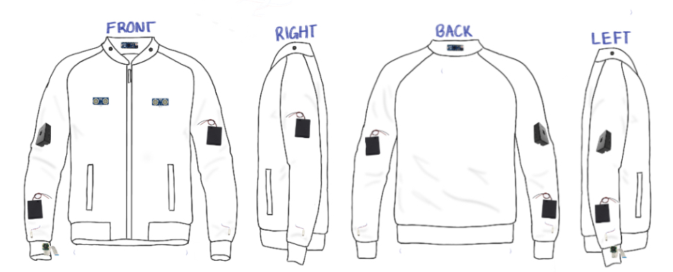

# The Assistive Smart Jacket: Technology of The Future

| **Engineer** | **School** | **Area of Interest** | **Grade** | 
|:--:|:--:|:--:|:--:|
| Anvika V | Princeton Day School | Computer Engineering | Incoming Senior |

This smart jacket is equipped with an array of sensors that offer intuitive assistance. From built-in object detection to real-time text-to-speech conversion, it is designed to be multi-functional and offer discrete aid.

My journey with assistive technology does not end with this project. I'm excited to continue my education in engineering. I believe in technology's capacity to mold a more promising tomorrow, and I hope this project serves as an inspiration to other young minds. There are countless ways to expand on my work below and if you find yourself exploring them, reach out to me at anvikavasireddy@gmail.com! 

* * *

<p align="center">

</p>

<!--<div align="center">
<iframe width="560" height="315" src="https://www.youtube.com/embed/eLwhJpBoEEo" title="YouTube video player" frameborder="0" allow="accelerometer; autoplay; clipboard-write; encrypted-media; gyroscope; picture-in-picture; web-share" allowfullscreen></iframe>
</div>-->
  
# Object Detection

<p align="center">

</p>
<p align="center">
<font size="1"> Anvika V. 2023 First Milestone [Photograph]. </font>
</p>

  The first step of this project was to develop a system that assists visually-impaired individuals navigate space by alerting the user of objects within a 70cm radius with either haptic or auditive feedback. As the object gets closer to the user, the system responds with more frequent vibrating or buzzing; a toggle switch is used to change between the two types of sensory feedback. Additionally, to establish a visual debugging method, the circuit has a 5mm red LED that lights up harmoniously with the sensors. Next, I will expand this by integrating a Raspberry Pi to translate text into Morse code and attaching it to a jacket to make it wearable.
  
<div align="center">
<iframe width="560" height="315" src="https://www.youtube.com/embed/eLwhJpBoEEo" title="YouTube video player" frameborder="0" allow="accelerometer; autoplay; clipboard-write; encrypted-media; gyroscope; picture-in-picture; web-share" allowfullscreen></iframe>
</div>

### Schematics Part 1

<p align="center">

</p>
<p align="center">
<font size="1"> Anvika. 2023 First Milestone Schematic [Tinkercad Circuit Diagram]. </font>
</p>
For object detection, I measured the distance  signals from an ultrasonic sensor traveled and converted it into centimeters with the microsecondsToCentimeters() function. The vibrating motor, buzzer, and led would then flicker on and off in response as long as the wave traveled less than 70 cm. The frequency of the pulsing would increase as the object got closer.


### Code
```c++
  void loop()
  {
    long duration, cm; //Variables for wave duration and wave distance   
    digitalWrite(pingTrigPin, LOW); //Confirming that the trigPin is clear   
    delayMicroseconds(2);
    digitalWrite(pingTrigPin, HIGH); //Generating a wave by setting trigPin to HIGH for 5 microseconds and then back to low
    delayMicroseconds(5);
    digitalWrite(pingTrigPin, LOW);
    duration = pulseIn(pingEchoPin, HIGH); //Storing the travel time is variable duration
    cm = microsecondsToCentimeters(duration); //Converting to distance   
    if(cm<=70 && cm>0) //Makes the light blink faster when the distance is smaller --> starts blinking at 70cm
    {
      int d= map(cm, 1, 100, 20, 2000); //d stores a variable that reformats a range
      digitalWrite(buz, HIGH); //Turning light on for .1 second  
      delay(100);
      digitalWrite(buz, LOW); //Turning light off 
      delay(d); //Waiting for a time that corresponds to the variable cm
    }
  }
 
```

### Bill of Materials

| **Part** | **Quantity** | **Note** | **Unit Price** | **Link** |
|:--:|:--:|:--:|:--:|
| Arduino Micro | 1 | Microcontroller | $24.90 | <a href="https://store-usa.arduino.cc/products/arduino-nano?selectedStore=us"> Arduino Store </a> |
| Ultrasonic Sensor | 1 | Object Detection | $3.95 | <a href="https://www.digikey.com/en/products/detail/adafruit-industries-llc/3942/9658069?utm_adgroup=&utm_source=google&utm_medium=cpc&utm_campaign=PMax%20Shopping_Product_High%20ROAS%20Categories&utm_term=&utm_content=&gclid=Cj0KCQjwoeemBhCfARIsADR2QCvdct9ZQj4tz0uKaFE7A8b9jxVh9Svgka9okB9HelglRaPaI8nZRfUaAtbZEALw_wcB"> Digikey </a> |
| Vibrating Motor | 1 | Haptic Feedback | $1.90 | <a href="https://www.digikey.com/en/products/detail/seeed-technology-co.,-ltd/316040001/5487672?utm_adgroup=Seeed%20Technology%20Co.%2C%20LTD.&utm_source=google&utm_medium=cpc&utm_campaign=Shopping_DK%2BSupplier_Tier%201%20-%20Block%202&utm_term=&utm_content=Seeed%20Technology%20Co.%2C%20LTD.&gclid=Cj0KCQjwoeemBhCfARIsADR2QCtoECYhEt77AOmON02Ffdc9PCfrDuJbs5MAgV3U6VQzc4a4WhZQ-90aAk4zEALw_wcB"> DigiKey </a> |
| Buzzer | 1 | Auditive Feedback | $.70 | <a href="https://www.amazon.com/mxuteuk-Electronic-Computers-Printers-Components/dp/B07VK1GJ9X/"> Amazon </a> |
| 5mm Red LED | 1 | Visual Troubleshooting  | $0.45 | <a href="https://www.sparkfun.com/products/9590"> SparkFun </a> |
| Slide Switch | 1 | Selecting Haptic of Auditive Feedback  | $0.27 | <a href="https://www.amazon.com/HiLetgo-SS-12D00-Toggle-Switch-Vertical/dp/B07RTJDW27/"> Amazon </a> |
| 220Ω Resistor | 1 | Limiting Current to LED | $0.44 | <a href="https://www.mcmaster.com/1348N356/"> McMaster-Carr </a> |
| Breadboard | 1 | Intial Circuit Base | $4.95 | <a href="https://www.adafruit.com/product/64"> Adafruit </a> |
| Male-to-Female Jumper Wires | 1 | Connecting Wires | $2.10 | <a href="https://www.digikey.com/en/products/detail/sparkfun-electronics/PRT-12794/5993859?utm_adgroup=&utm_source=google&utm_medium=cpc&utm_campaign=PMax%20Shopping_Product_High%20ROAS%20Categories&utm_term=&utm_content=&gclid=Cj0KCQjwoeemBhCfARIsADR2QCtyZU8zjUzIar3x82ijXdVH7xfaRfGgUX5U579Ti4dJXUiiGk269uQaAoPhEALw_wcB"> DigiKey </a> |
| Breadboard Jumper Wires | 1 | Connecting Wires | $11.99 | <a href="https://www.amazon.com/AUSTOR-Lengths-Assorted-Preformed-Breadboard/dp/B07CJYSL2T/ref=asc_df_B07CJYSL2T/?tag=hyprod-20&linkCode=df0&hvadid=312209999515&hvpos=&hvnetw=g&hvrand=3356264878582093939&hvpone=&hvptwo=&hvqmt=&hvdev=c&hvdvcmdl=&hvlocint=&hvlocphy=9004018&hvtargid=pla-569895146522&psc=1"> Amazon </a> | 
<font size="1"> Prices as of August 2023 </font>


# Text-to-Speech Conversion

<div align="center">
<iframe width="560" height="315" src="[https://www.youtube.com/embed/y3VAmNlER5Y](https://prezi.com/v/view/DcSKiovgZVgT32lMbmLB/)" title="YouTube video player" frameborder="0" allow="accelerometer; autoplay; clipboard-write; encrypted-media; gyroscope; picture-in-picture; web-share" allowfullscreen></iframe>
</div>

<p align="center">

</p>
<p align="center">
<font size="1"> Anvika. 2023 _Second Milestone_ [Tinkercad Circuit Diagram]. </font>
</p>

<!---->

  The first modification I implemented started from the idea of a text-to-braille translator. I planned to use Raspberry Pi OpenCV to read text and use an Arduino Micro to control a braille display. However, with the idea of this display came a plethora of technical problems. Creating a display small enough to be portable and lightweight while still translating more than a sentence at a time into braille would require extremely small motors and sensors. Then came the development of a Morse Code translator using the same vibrating motor from the base project. 

### Code for Morse Code Translator (Arduino)
```c++
void loop() 
{
  char ch;
  if (Serial.available())
  {
    ch = Serial.read(); // read a single letter if (ch >= 'a' && ch <= 'z')
    Serial.print(ch);
    if (ch >= 'a' && ch <= 'z')
    {
      flashSequence(letters[ch - 'a']);
    }
    else if (ch >= 'A' && ch <= 'Z') 
    {
      flashSequence(letters[ch - 'A']); 
    }
    else if (ch >= '0' && ch <= '9') 
    {
      flashSequence(numbers[ch - '0']); 
    }
    else if (ch == ' ') 
    {
      delay(dotDelay * 4);
    }
  }
}  
```
  
  Later, I realized that Morse code, like Braille, is not an accessible method of communication; as a matter of fact, only 1% of the population can understand Morse code. So to complete this milestone, I decided to create a text-to-speech translator and control it with a Raspberry Pi. The first step was connecting my Pi to my computer remotely. I encountered a setback in this process when my computer (Mac OS) had trouble connecting to my Pi through a VNC Server and lagged noticeably when connected through a terminal. After 4 days of trying to debug the problem, I decided to reflash the SD card in the Pi and connect it to a monitor.
  
  After establishing a strong connection to the Pi, I started working on live text recognition using Python. I soon faced the issue of dealing with blurry photos that the Pi was unable to read. By manually adjusting the focus of the PiCam and going through several rounds of testing, I successfully converted text into speech. 
  
  Finally, I added a battery pack to my starter project:

<p align="center">

</p>
<p align="center">
<font size="1"> Anvika. 2023 _First Milestone with Battery_ [Photograph]. </font>
</p> 

### Schematics Part 2
  Before I started to work on my third milestone, I made a circuit diagram on Tinkercab for the object detection system on the jacket:
  
<p align="center">

</p>
<p align="center">
<font size="1"> Anvika. 2023 _Second Milestone Schematics_ [Tinkercad Circuit Diagram]. </font>
</p> 


# Jacket Integration
<!-- For your final milestone, explain the outcome of your project. Key details to include are:
- What you've accomplished since your previous milestone
- What your biggest challenges and triumphs were at BSE
- A summary of key topics you learned about
- What you hope to learn in the future after everything you've learned at BSE

Adding to jacket
Creating two circuits > all soldered and ready to pop in jacket
Having buzzer at the collar 
Camera at the hand
Vibrating motor at the wrist 
Sparkly? Most individuals with blindness can see very reflective objects, such as things covered in sparkles (85%)

**Don't forget to replace the text below with the embedding for your milestone video. Go to Youtube, click Share -> Embed, and copy and paste the code to replace what's below.**

<iframe width="560" height="315" src="https://www.youtube.com/embed/F7M7imOVGug" title="YouTube video player" frameborder="0" allow="accelerometer; autoplay; clipboard-write; encrypted-media; gyroscope; picture-in-picture; web-share" allowfullscreen></iframe>
-->
### Schematics Part 3

<p align="center">

</p>
<p align="center">
<font size="1"> Anvika. 2023 _Third Milestone Schematics_ [Digital Drawing]. </font>
</p> 


